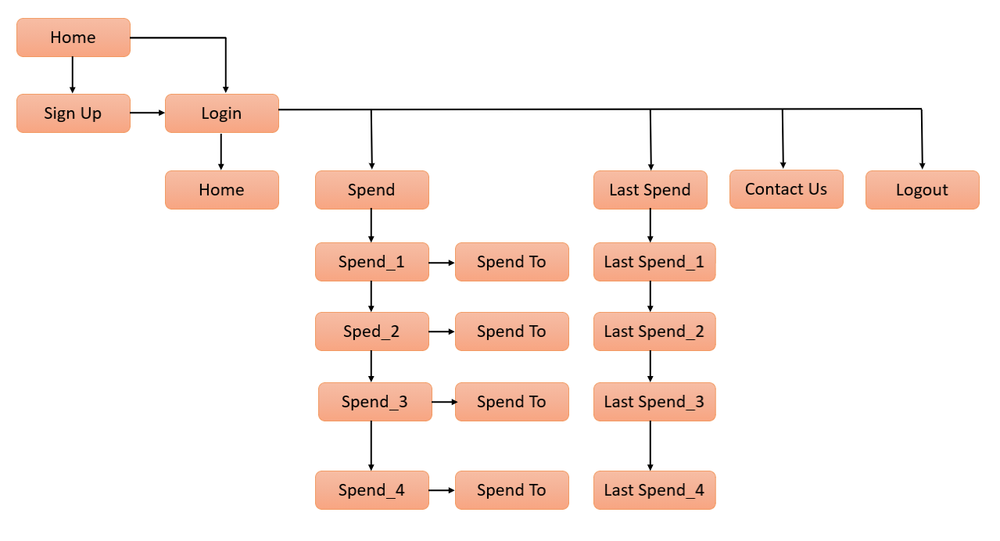
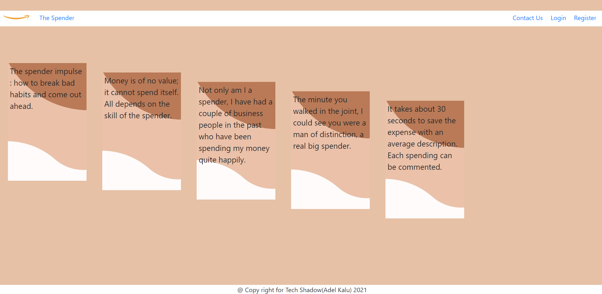
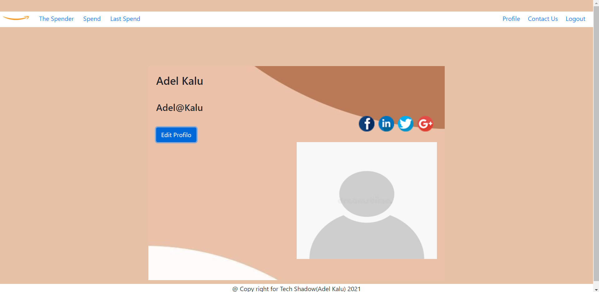
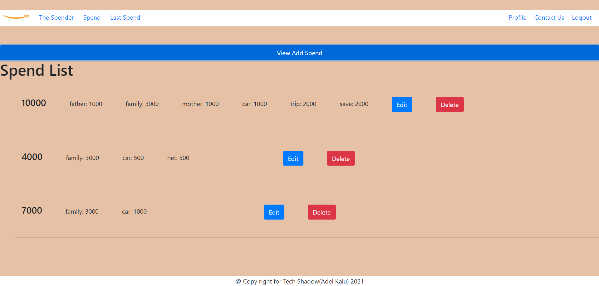
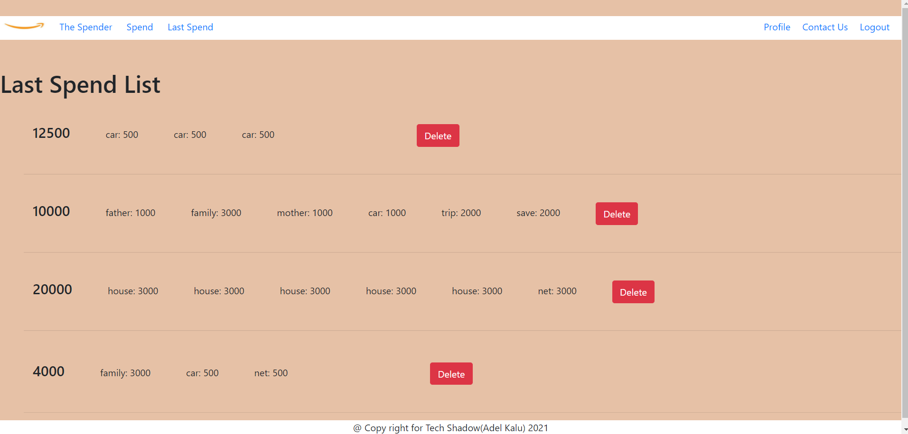
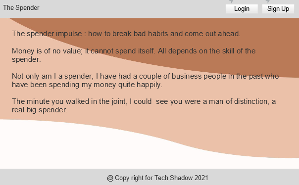
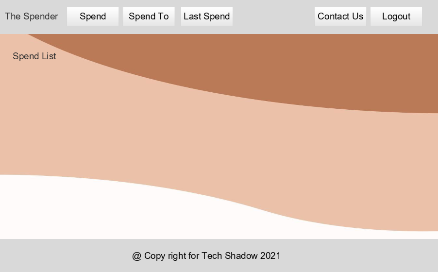

# The Spender:

This application allows the user to add his salary or any amount and divide it into several things, which helps him spend his money well.


## Important Links

- [Demo](https://youtu.be/YBQ13V3ItZw)
- [API Repo](https://git.generalassemb.ly/adel-kalu/TheSpender)
- [Deployed API](http://thespender-env.eba-2jbixpmp.us-east-2.elasticbeanstalk.com/)
- [Deployed Client](https://pages.git.generalassemb.ly/adel-kalu/The-Spender/)

## Planning Story
Follow the planning step by step:


### User Stories

- As a user I want to sign in/up
- As a user I want to edit my profile
- As a user I want to create a new spend record
- As a user I want to read multiple spends record
- As a user I want to edit and delete a single spend record I own
- As a user I want to read multiple last spends record
- As a user I want to delete a single last spend record I own

### Technologies Used

- React
- HTML/CSS
- Bootstrap
- Javascript
- jQury
- axios
- git
- git hub

### Unsolved Problems
- Change password with current and new password.

## Set up and Installation instructions
You need to add these command in react app:
1. React Router DOM:
  ```
   npm install react-router-dom 
   ```
 Add this import in the js file you use it:
  ```
 import {BrowserRouter as Router, Route, Link} from 'react-router-dom';
```

2. Axios:
  ```
  npm install axios
  ```
 Add this import in the js file you use it:
  ```
import axios from 'axios';
  ```

3. jsonwebtoken:
  ```
  npm install jsonwebtoken
  ```
 Add this import in the js file you use it:
  ```
import { decode } from "jsonwebtoken";
  ```

4. React-Bootstrap:
  ```
  npm install react-bootstrap bootstrap
  ```
 Add this import in the index.js:
  ```
 import 'bootstrap/dist/css/bootstrap.min.css';
  ```

## Images:

#### App Screenshot:





---

#### Wireframe:



